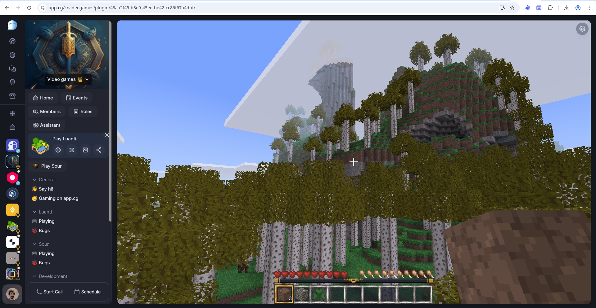
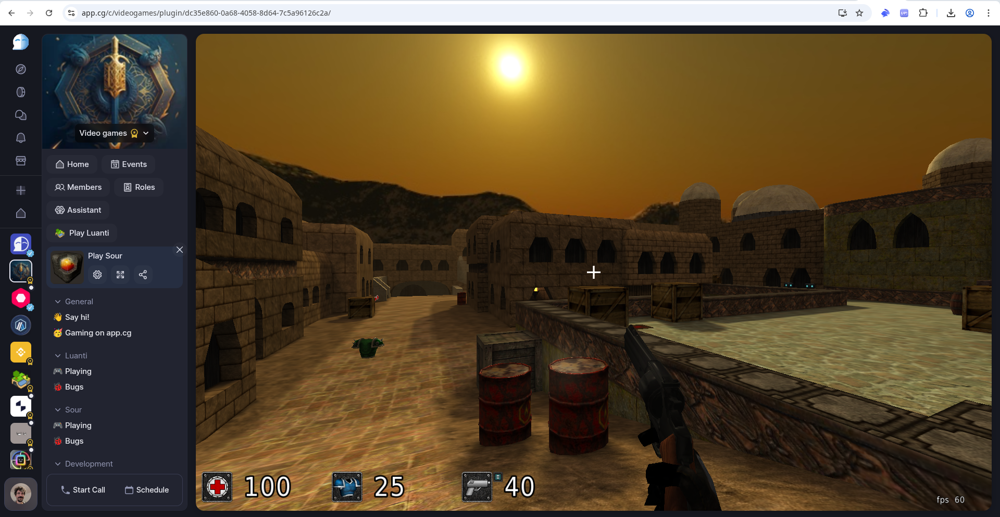

## The Common Games Collection

This repository is part of a broader effort to unify the build and setup process of amazing open source games for the web. I realized there are a lot of such games out there that have a somewhat working web version, but the build process is often cumbersome, not beginner friendly, and also requires a specific system setup to work.

I am collecting such games and make a basic set of changes:

1.) Provide a proper dockerized build system, so anyone can easily build the game. This way, the community can focus on game modifications, and there's once "centralized" place where build and setup can be discussed

2.) Provide a production-ready docker container for the game. This allows easy hosting for anyone.

3.) Provide a proper hosting setup. The game should be hostable behind a reverse nginx proxy (for easy https), and also on a freely choosable url / path.

With those pre-requisites, I hope to build a growing collection of permissively licensed games and an ecosystem of gamers and contributors. There are decades of games made with love by artists, coders and - sometimes ancient - communities. I consider the Common Games Collection an effort to find the gold nuggets and artifacts that the internet gives us, and bring them together in one happy, easy to use collection.

## Games

**Luanti**: https://github.com/Kaesual/minetest-wasm

[Luanti](https://www.luanti.org/) is a fully Open Source voxel game engine that allows creation of games that look and feel like Minecraft, started in 2010 and written in c++. Until today, it has an active community of maintainers, contributors and players. There's also the [Luanti ContentDB](https://content.luanti.org/) where many games and mods can be found.

**Sauerbraten**: https://github.com/Kaesual/sour

[Sauerbraten](http://sauerbraten.org/) is a fully Open Source first person shooter that reminds of Quake 2 and early Unreal Tournament versions, started in 2004 and written in c++. It supports many game modes (ffa, insta, ctf...) and comes with Game Server and Web Assembly Game client built in. Host it and play with others instantly.

## Get in touch

The *Quest* of Common Games is to gather great Open Source games and make them available as browser versions. My goal is to bring together a community of players and developers, to bring "good old LAN party vibes" into the browser. There are several options to get involved:

**Common Ground**

I'm the founder of a community platform named Common Ground, which runs on [app.cg](https://app.cg). It has many features similar to Discord or Slack, but it completely (and only) runs in the Browser. Custom software (like games) can be embedded into communities as iframes, and can be connected to the platform through an API.

That's my personal reason to build the Common Games Collection - all of the games are available as community plugins on app.cg. We're also planning to make the whole Common Ground platform available under a permissive community license this year - stay tuned! You can learn more about the project here: [Common Ground DAO on github](https://github.com/Common-Ground-DAO).

To play the game and get in touch for gaming, sign up and join the [Common Games Community](https://app.cg/c/commongames/). For the Common Ground project itself, join our [Common Ground Community](https://app.cg/c/commonground/).

**Discord**

I understand that not everyone is willing to sign up to a new platform, and that's fine. I am also running a Discord community for everyone else, so come join the [Common Games Community on Discord](https://discord.gg/FcK7PsdXtF) in case this is your preferred option.
